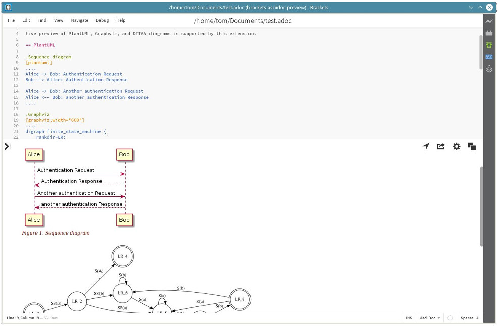
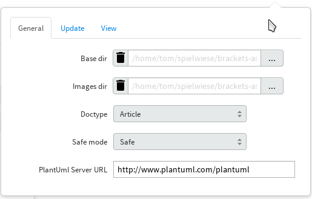
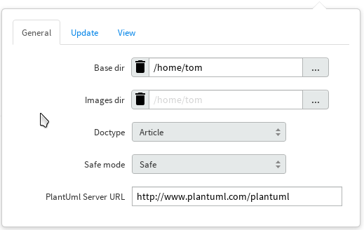
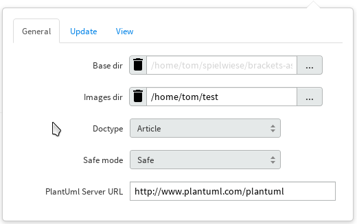
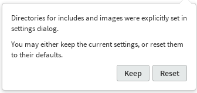

= Adobe Brackets 的 AsciiDoc 实时预览
Doc Writer <tequlia2pop@gmail.com>
Thomas Kern
:idprefix:
:idseparator: -
:experimental:
:homepage: https://github.com/asciidoctor/brackets-asciidoc-preview

这是 http://brackets.io[Adobe Brackets] 的扩展，它允许实时预览 AsciiDoc 文档。渲染的文档也可以导出到浏览器进行打印或转换为 PDF。

== 安装

=== 发布版本

建议使用发布版本来安装该扩展。

从 Brackets file 目录，打开 extension manager。浏览可用的扩展并安装 AsciiDoc Preview。

安装后，在 Brackets 右边的工具栏会出现一个额外的图标。如果当前编辑文件的名称以 '.adoc', '.ad', '.asciidoc', 或 '.asc' 作为结尾，当点击这个图标时会显示预览窗格。

在预览窗格的右上角，点击齿轮符号 () 会打开设置面板。

=== 开发版本

In order to install the current development version, you need to have *npm* and *grunt-cli* installed. *npm* is 
the package manager of http://nodejs.org/[node.js]. After downloading and installing *node.js*, install
a system-wide version of *grunt-cli*:xxx

----
npm install -g grunt-cli
----

Clone this repository and invoke the following commands from the project's toplevel directory:

----
npm install
grunt dist
----

This will create a zipfile in the current directory which can be installed from the Brackets extension 
manager by dropping the zipfile onto the input area in the dialog's lower left corner.

If you need to install previous versions of the plugin, you may do so by downloading a tagged release 
as a zipfile, unpack the zipfile and proceed in the same way as described above.

== Asciidoctor 图表

从版本 1.1.5 起，可以预览 https://github.com/asciidoctor/asciidoctor-diagram[Asciidoctor 图表扩展] 的子集。

支持以下图表类型：

* http://www.plantuml.com[PlantUml diagrams]
* http://ditaa.sourceforge.net[Ditaa]
* http://graphviz.org/content/dot-language[Graphviz dot]

限制：

* Shaape, BlockDiag, SeqDiag, ActDiag, NwDiag, rackdiag, and packetdiag are not supported.
* Using the block macro format to include diagrams from external files, .e.g.
  `plantuml::diagram.txt[]` does not work. You can combine the listing block format syntax with a
  regular include macro instead:
+
  [plantuml]
  ----
  include::diagram.txt[]
  ----

Actual formatting of diagrams if performed by a PlantUml server. You may either set up
and operate your own https://github.com/plantuml/plantuml-server[plantuml-server],
or use a publicly available one.

The URL of the server you want to use must be entered in the "General" tab of the plugin's settings panel (gear symbol
in the preview pane).

CAUTION: Only use a public server if you do not care about the confidentiality of your data.
Your diagrams are being sent to some place with possibly unclear privacy and security policies.
This is particularly important for corporate users!

A public server is available here:

----
http://www.plantuml.com/plantuml
----

== MathJax 支持

Rendering of mathematical expressions is supported by means of http://www.mathjax.org/[MathJax].
Unlike other components used by this plugin, MathJax is not included in the distribution,
but accessed via a CDN.

This means that you'll need a working internet connection in order to be able to see rendered expressions,
at least until MathJax was loaded and cached by Brackets for the first time.

The use of MathJax is disabled by default and must be switched on in the plugin's settings panel
by checking btn:[Render math]. See http://asciidoctor.org/news/2014/08/12/asciidoctor-1-5-0-released/#spotlight-mathjax[Get technical with MathJax].

WARNING: With MathJax enabled, the content of the preview pane will bounce during each refresh. 
It is therefore recommended that you only enable MathJax if really necessary. You may probably
also want to check btn:[Update on save] (see below). 

== 同步预览窗格

可以对编辑器中当前编辑的位置和预览窗格中渲染的相应 HTML 部分进行同步。

在文档被成功渲染后，点击位置箭头图标 () 会根据源文档中当前文本光标的位置，进行滚动以使对应的 HTML 部分可见。

另外，设置面板提供了一个按钮: [Auto-sync location] 选项。如果启用该选项，预览窗格将自动将位置同步到当前编辑的文档部分。

还可以通过同时按住 [Ctrl] 和点击预览窗格来跳转到文档编辑器中的对应行。

NOTE: 由于同步在段落和块的级别上工作，所以匹配并不完美。目前不可以在块中找到正确的位置，而只能找到整个块的起始位置。 例如，如果你使用很长的表格或列表，预览窗格将显示表格或列表的开头，但你正在编辑的位置可能却在屏幕之外。对于包含其他文件的文档，同步功能也不起作用。

IMPORTANT: 如果来自 Asciidoctor 的文档转换产生了错误或警告消息，则不能使用同步所需的信息。位置箭头将被隐藏，直到文档被修复。

== Update-on-Save 选项

由于较大的文档被转换并显示在预览窗格中需要一些时间，最好在输入文本时不要立即更新预览窗口。因此你需要在设置面板中检查按钮:[Update on save]。它使得仅当点击:[Ctrl+S] 或通过菜单保存文件的时候才会更新预览窗格。

== 导出到浏览器

可以点击导出图标 () 将预览窗格中显示的文档导出到浏览器。如果尚未打开，则启动默认的系统浏览器，并在新的浏览器选项卡中显示生成的 HTML 文档。然后可以使用浏览器来保存，转换或打印文档。

== Overriding Directory Settings

With Asciidoctor, files included in a master (top-level) document are resolved relative to the base directory, which defaults to the directory of the master document unless otherwise specified. When using Asciidoctor from the commandline, a base directory may be specified as a commandline option.

In addition, Asciidoctor also provides the built-in attribute named `imagesdir`. If this attribute is defined, included images are resolved relative to this directory instead of the base directory. In particular when editing documents included by a master document, the relative paths are usually broken and cannot be resolved correctly. Images are not shown in the preview pane or included files can not be found.

In order to resolve this, base and images directories may be specified from the settings dialog.

If no directories were set explicitly, base- and images directories default
to the directory of the document currently displayed. This is indicated 
by the light grey color of the paths displayed, as shown in the following screenshot:

After changing the base directory to `/home/tom`, the dialog looks as follows:

The base directory was explicitly set. This causes the *default of the images directory* to
be automatically changed to the same directory. As long as the images directory uses a default, any `imagesdir` attributes specified inside a document will still work as usual. 

However, if the images directory is explicitly set in the settings dialog,
all `ìmagesdir` attributes within the document are *ignored and forced* to the value specified in the dialog:

Document defaults may be restored by pressing the trashcan icon next to the input field.

If you switch to a document in a different directory, a warning message is displayed if 
base or the images directories were set.

You may either keep the settings as they are, or reset them to the new document's defaults.

== Custom Extensions

It is possible to install custom extensions to be used during rendering of the preview pane. The following types of files may be installed:

* Asciidoctor themes
* Asciidoctor extensions
* CSS files
* JavaScript files

Files should be copied to specific directories in the filesystem and are being registered by the plugin on startup. Depending on your OS, the root directory differs :

Linux:: <user home>/.config/Brackets/extensions/data.nerk.asciidoc-preview
Windows:: <user home>/AppData/Roaming/Brackets/extensions/data.nerk.asciidoc-preview

The directory structure must be created manually and each subdirectory must only contain a specific type of files:

----
data.nerk.asciidoc-preview
  |
  +-- extensions <1>
  |
  +-- styles <2>
  |
  +-- themes <3>
  |
  +-- scripts_prepend <4>
  |
  +-- scripts_append <5>
----
<1> Asciidoctor JavaScript extensions
<2> CSS files to be added to the header of the generated HTML. Put supporting CSS files for Asciidoctor extensions into this directory.
<3> CSS theme files. Files will appear in the preferences dialog and may be selected by the user.
<4> JavaScript files to be added to the HTML's head.
<5> JavaScript files to be added to the bottom of the generated HTML.

IMPORTANT: If the version of your Asciidoctor JavaScript extensions does not match the version of Asciidoctor used by this plugin, things might not work as expected. The current version is Asciidoctor 1.5.4.

== Known Issues

IMPORTANT: The following limitations only apply to documents displayed by the preview pane and *not* to the
actual conversion of a document with asciidoctor or when exporting the document to a browser.

* Preamble text directly following the title without an empty line in between is completely suppressed.
* In order to create
a TOC in your document, add attributes
+
----
:toc: 
:toc-placement: preamble
----
to the header of your document. Also make sure that your document
really has a preamble. Other values for +toc+ and +toc-placement+
attributes are currently not supported.

== Credits

The original version of this extension was based on Glenn Ruehle's https://github.com/gruehle/MarkdownPreview[Markdown preview extension], which I modified for AsciiDoc.

The actual formatting is performed by
https://github.com/asciidoctor/asciidoctor.js[Asciidoctor.js],
the JavaScript incarnation of http://asciidoctor.org/[Asciidoctor].

AsciiDoc mode for CodeMirror was created by 
Thaddee Tyl for https://github.com/espadrine/AsciiDocBox[AsciiDocBox], who
converted the highlighting mode from the Ace editor to CodeMirror.

Other software used:

* http://fortawesome.github.io/Font-Awesome/[Font Awesome 4.4.0] for font icons
* http://highlightjs.org/[highlight.js] for highlighting embedded source code
* http://www.mathjax.org/[MathJax] is a JavaScript display engine for mathematics

== Copyright and License

Copyright (C) 2014-2016 Thomas Kern

Licensed under MIT License. See https://raw.githubusercontent.com/nerk/asciidoc-brackets-preview/master/LICENSE.txt[LICENSE] for details.

Based on _MarkdownPreview_, Copyright (C) 2012 Glenn Ruehle.

AsciiDoc mode Copyright (C) 2014 https://github.com/espadrine[Thaddee Tyl]. Contains parts from https://github.com/ajaxorg/ace[Ace], Copyright (C) 2010, Ajax.org B.V. and published under BSD license.

Arrow-, trash can, and export icons made by http://yanlu.de[Yannick] from http://www.flaticon.com[www.flaticon.com], licensed under http://creativecommons.org/licenses/by/3.0/[CC BY 3.0]

Chevron icons made by http://www.flaticon.com/authors/dave-gandy[Dave Gandy] from http://www.flaticon.com[www.flaticon.com], licensed under http://creativecommons.org/licenses/by/3.0/[CC BY 3.0]

