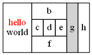
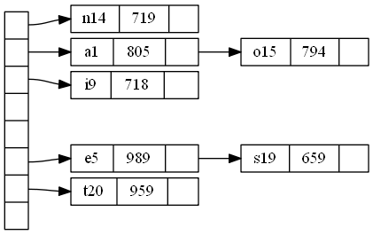
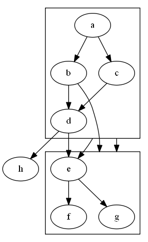

# Dot 指南

参考文档：[Drawing graphs with dot（PDF）](http://www.graphviz.org/pdf/dotguide.pdf)

## 基础的图形绘制

*dot* 可以绘制有向图。它读取含属性的图形文本文件，并以图形文件或图形格式（如 GIF，PNG，SVG，PDF 或 PostScript）来进行绘制。

*dot* 绘制图形有四个主要阶段。知道这些内容可以帮助你了解 *dot* 所采用的布局，以及如何控制它们。*dot* 使用的布局过程依赖于非循环的图形。因此，

1.  第一步是通过反转某些循环的边的内部方向来破坏输入图形中出现的任何循环。 

2.  下一步将节点（node）分配给离散的等级（rank）或级别（level）。在自顶向下的绘图中，等级确定了Y坐标。跨越多个等级的边被分解成一条链，链由“虚拟”节点和单位长度的边组成。

3.  第三步按等级排列节点以避免交叉。

4.  第四步设置节点的X坐标以保持边较短。

5.  最后一步路由边的 spline。

这与大多数结构图形的绘图程序是一样的，基于 Warfield ，Carpano 和 Sugiyama 的工作。 我们将阅读引用到 [GKNV93]，以便对 *dot* 的算法进行彻底的解释。

*dot* 接受 *DOT* 语言的输入（参见附录D）。 这种语言描述了三种主要的对象：图形（graph），节点（node）和边（edge）。 主（最外面的）图形可以是有向图（`digraph`）或无向图（`graph`）。 因为 *dot* 可以构建有向图的布局，所有以下示例都使用 `digraph`。 在一个主图形中，`subgraph` 定义了节点和边的子集。

图1是使用 *DOT* 语言的示例图。第1行给出图形的名称和类型。 下面的行创建节点，边或子图形，并设置属性。 所有这些对象的名称可以是标识符，数字或引用的字符串。 引号保护了标点和空白符。

Figure 1: Small graph
```
digraph G {
	main -> parse -> execute;
	main -> init;
	main -> cleanup;
	execute -> make_string;
	execute -> printf
	init -> make_string;
	main -> printf;
	execute -> compare;
}
```

当节点的名字首先出现在文件中时，就会创建一个节点。 当边操作符 `->` 连接节点时，就会创建一个边。 在这个例子中，第2行创建了从 *main* 到 *parse* 的边，以及从 *parse* 到 *execute* 的边。 在这个文件（称为 `graph1.gv`）上运行 *dot*：

```
$ dot -Tps graph1.gv -o graph1.ps
```

这会产生图2的绘图。命令行选项 `-Tps` 选择 PostScript（EPSF）输出。`graph1.ps` 可以输出，并由 PostScript 查看器显示，或嵌入另一个文档中。

Figure 2: Drawing of small graph


调整布局中节点和边的表示或位置通常很有用。这通过在输入文件中设置节点，边或子图形的属性来完成。 属性是字符串形式的名-值对。图3和图4说明了一些布局属性。在图3的列表中，第2行将图形的大小设置为 4,4（英寸）。 该属性控制图形的大小; 如果绘图太大，则根据需要均匀地缩放。

Figure 3: Fancy graph
```
digraph G {
	size ="4,4";
	main [shape=box]; /* this is a comment */
	main -> parse [weight=8];
	parse -> execute;
	main -> init [style=dotted];
	main -> cleanup;
	execute -> { make_string; printf}
	init -> make_string;
	edge [color=red]; // so is this
	main -> printf [style=bold,label="100 times"];
	make_string [label="make a\nstring"];
	node [shape=box,style=filled,color=".7 .3 1.0"];
	execute -> compare;
}
```

Figure 4: Drawing of fancy graph


节点或边的属性在方括号中设置。在第3行中，节点 `main` 的形状被设置为 `box`。 第4行的边通过增加 `weight` 来矫直（默认值为1）。第6行中的边被绘制为虚线。第8行使得边从 `execute` 到 `make_string` 和 `printf`。 在第10行中，默认的边的颜色设置为红色。这会影响文件中此点之后创建的任何边。第11行创建一条粗体的边，并标记为 `100 times`。在第12行中，节点 `make_string` 被赋予了一个 multi-line 标签。 第13行将默认节点更改为带有蓝色阴影的矩形。节点 `compare` 继承了这些值。

## 绘制图形

影响图形绘制的主要属性在附录A，B和C中进行了总结。对于属性的更多和更完整的描述，你应该参考 Graphviz 网站，地址如下：www.graphviz.org/doc/info/attrs.html

### 节点的形状

节点被默认绘制为 `shape=ellipse, width=.75, height=.5
`，并标记为节点名称。其他常见的形状包括 `box`，`circle`，`record` 和 `plaintext`。 附录H给出了主要的节点形状的列表。节点形状 `plaintext` 特别感兴趣的是它绘制一个没有任何轮廓的节点，这在某些类型的图表中是重要的约定。 在主要关注图形结构的情况下，特别是当图形适度大时，`point` 形状减少了节点以显示最小的内容。 When drawn, a node’s actual size is the greater of the requested size and the area needed for its text label, unless `fixedsize=true`, in which case the `width` and `height` values are enforced.

节点形状分为两大类：基于多边形和基于记录的。 除 `record` 和 `Mrecord` 之外的所有节点形状都被认为是多边形，并且由边的数量建模（椭圆和圆形是特殊情况），以及几个其他几何属性。 这些属性中的一些可以在图中指定。如果 `regular=true`，则该节点被强制为常规。参数 `peripheries` 设置绘制的边界曲线的数量。例如，双圆圈的 `peripheries=2`。`orientation` 属性指定多边形的顺时针旋转，以度为单位。

形状 `polygon` 公开了所有的多边形参数，并且可用于创建许多未被预定义的形状。除了上述参数 `regular`，`peripheries` 和 `orientation` 之外，多边形通过 `sides`，`skew` 和 `distortion` 来参数化。 `skew` 是一个浮点数（通常在 -1.0 和 1.0 之间），通过从顶部到底部倾斜来扭曲形状，正值将多边形的顶部向右移动。 因此，可以使用 `skew` 将矩形变成平行四边形。`distortion` 从顶部到底部收缩多边形，负值导致底部大于顶部。 `distortion` 将矩形变成梯形。图6和图5中演示出了多种这些多边形属性。

Figure 5: Graph with polygonal shapes
```
digraph G {
	a -> b -> c;
	b -> d;
	a [shape=polygon,sides=5,peripheries=3,color=lightblue,style=filled];
	c [shape=polygon,sides=4,skew=.4,label="hello world"]
	d [shape=invtriangle];
	e [shape=polygon,sides=4,distortion=.7];
}
```

Figure 6: Drawing of polygonal node shapes


基于记录的节点形成了另一类节点形状。这些包括形状 `record` 和 `Mrecord`。这两个形状是相同的，只是后者有圆角。 这些节点表示了字段的递归列表，它们被绘制为交替的水平和垂直行的矩形。递归结构由节点的 `label` 确定，`label` 具有以下模式：


文字括号，竖条和尖括号必须转义。空格被解释为 token 之间的分隔符，因此如果要在文本中逐字出现，则必须转义它们。 *boxLabel* 中的第一个字符串为该字段提供了一个名称，并作为该矩形的端口名称（port name）。 第二个字符串用作字段的标签; 它可能包含与多行标签相同的转义序列。 图7和图8的例子说明了如何使用记录及其某些属性。

Figure 7: Records with nested fields
```
digraph structs {
	node [shape=record];
	struct1 [shape=record,label="<f0> left|<f1> mid\ dle|<f2> right"];
	struct2 [shape=record,label="<f0> one|<f1> two"];
	struct3 [shape=record,label="hello\nworld |{ b |{c|<here> d|e}| f}| g | h"];
	struct1 -> struct2;
	struct1 -> struct3;
}
```

Figure 8: Drawing of records


### 标签（Label）

如上所述，节点的默认标签是它的名称。边默认不会设置标签。可以使用 `label` 属性显式设置节点和边的标签，如图4所示。

虽然按名称标记节点可能很方便，但在其他时候必须明确地设置标签。例如，在绘制文件目录树时，可能有几个名为 `src` 的目录，但每个目录必须具有唯一的节点标识符。节点的索引或完整的路径名称是唯一的标识符。 然后可以将每个节点的标签设置为其目录中的文件名。

可以通过使用转义序列 `\n`，`\l`，`\r` 来终止居中或左右对齐的行，这样可以创建多行标签。

图和集群子图也可以有标签。默认情况下，图的标签显示在图的下方。设置 `labelloc=t` 可以使标签位于图的上方。 集群的标签出现在封闭矩形的左上角。设置 `labelloc=b` 可以将标签移动到矩形的底部。设置 `labeljust=r` 可以将标签移动到右方。

The default font is 14-point Times-Roman, in black. Other font families, sizes and colors may be selected using the attributes `fontname`, `fontsize` and `fontcolor`. Font names should be compatible with the target interpreter. It is best to use only the standard font families Times, Helvetica, Courier or Symbol as these are guaranteed to work with any target graphics language. For example, `Times-Italic`, `Times-Bold`, and `Courier` are portable; `AvanteGardeDemiOblique` isn’t.

For bitmap output, such as GIF or JPG, *dot* relies on having these fonts available during layout. Most precompiled installations of *Graphviz* use the fontconfig library for matching font names to available fontfiles. fontconfig comes with a set of utilities for showing matches and installing fonts. Please refer to the fontconfig documentation, or the external *Graphviz* FontFAQ or for further details. If *Graphviz* is built without fontconfig (which usually means you compiled it from source code on your own), the `fontpath` attribute can specify a list of directories which should be searched for the font files. If this is not set, dot will use the DOTFONTPATH environment variable or, if this is not set, the GDFONTPATH environment variable. If none of these is set, *dot* uses a built-in list.

Edge labels are positioned near the center of the edge. Usually, care is taken to prevent the edge label from overlapping edges and nodes. It can still be difficult, in a complex graph, to be certain which edge a label belongs to. If the `decorate` attribute is set to true, a line is drawn connecting the label to its edge. Sometimes avoiding collisions among edge labels and edges forces the drawing to be bigger than desired. If `labelfloat=true`, dot does not try to prevent such overlaps, allowing a more compact drawing.

An edge can also specify additional labels, using `headlabel` and `taillabel`, which are be placed near the ends of the edge. The characteristics of these labels are specified using the attributes `labelfontname`, `labelfontsize` and `labelfontcolor`. These labels are placed near the intersection of the edge and the node and, as such, may interfere with them. To tune a drawing, the user can set the `labelangle` and `labeldistance` attributes. The former sets the angle, in degrees, which the label is rotated from the angle the edge makes incident with the node. The latter sets a multiplicative scaling factor to adjust the distance that the label is from the node.

### HTML-like Labels

Figure 9: HTML-like labels
```
digraph html {
	abc [shape=none, margin=0, label=<
<TABLE BORDER="0" CELLBORDER="1" CELLSPACING="0" CELLPADDING="4">
	<TR><TD ROWSPAN="3"><FONT COLOR="red">hello</FONT><BR/>world</TD>
		<TD COLSPAN="3">b</TD>
		<TD ROWSPAN="3" BGCOLOR="lightgrey">g</TD>
		<TD ROWSPAN="3">h</TD>
	</TR>
	<TR><TD>c</TD>
		<TD PORT="here">d</TD>
		<TD>e</TD>
	</TR>
	<TR><TD COLSPAN="3">f</TD>
	</TR>
</TABLE>>];
}
```
Figure 10: Drawing of HTML-like labels



### 图形的样式

节点和边可以指定一个 `color` 属性，默认值是黑色。这用于绘制节点的形状或边的颜色。`color` 值可以是一个 huesaturation-brightness triple（三个在0和1之间的浮点数，用逗号分隔）; 附录中列出的颜色名称之一（从X窗口系统的某些版本中借用）; 或红-绿-蓝（RGB）三重（三个在00和FF之间的十六进制数字，前面加上‘#’）。 因此，值 "orchid"，"0.8396,0.4862,0.8549" 和 "#DA70D6" 是三种指定相同颜色的方式。 数字表格对于自动生成颜色的脚本或工具很方便。颜色名称查找是不区分大小写的，忽略非字母数字的字符，因此 `warmgrey` 和 `Warm_Grey` 是等效的。

我们可以提供有关在图形绘制中使用颜色的几点提示。 

*   首先，避免使用太多明亮的色彩。 “彩虹效应”会令人困惑。 最好选择较窄的颜色范围，或者随着色调而改变饱和度。 

*   第二，当节点填充为深色或非常饱和的颜色时，标签似乎更加可读，`fontcolor=white` 和 `fontname=Helvetica`。 （dot 也有 PostScript 功能，用于从普通字体创建轮廓字体。）

*   第三，在某些输出格式中，你可以定义自己的 color space。 例如，如果使用 PostScript 作为输出，可以在库文件中修改 `nodecolor`，`edgecolor`` 或 `graphcolor`。 

因此，要使用 RGB 颜色，请将以下行放在文件 lib.ps 中。

```
/nodecolor {setrgbcolor} bind def
```

使用 `-l` 命令行选项来加载此文件。

```
dot -Tps -l lib.ps file.gv -o file.ps
```

`style` 属性控制节点和边的各种图形特征。此属性是一个以可选参数列表的逗号分隔的基元列表。预定义的基元包括 `solid`，`dashed`，`dotted`，`bold` 和 `invis`。前4个负责控制节点边界和边的绘制，它们具有明显的含义。The value `invis`` causes the node or edge to be left undrawn.  

节点的样式还可以包括 `filled`，`diagonals` 和 `rounded`。 

*   `filled`  表示使用 `fillcolor` 颜色来填充节点内部的阴影。如果未设置 `fillcolor`，则使用 `color`。如果 `color` 也没有设置，则使用浅灰色（light grey）作为默认值。

*   `diagonals`  The `diagonals`` style causes short diagonal lines to be drawn between
pairs of sides near a vertex

*   `rounded`  The `rounded`` style rounds polygonal corners.

用户定义的样式基元可以实现为自定义 PostScript 过程。在绘制任何标记之前，这些基元在图形，节点或边的 `gsave` 上下文中执行。参数列表被翻译成 PostScript 符号。例如，具有 `style="setlinewidth(8)"` 的节点绘制为粗略的轮廓。 在这里，`setlinewidth` 是 PostScript 内置的，用户定义的 PostScript 过程被称为相同的方式。可以在使用 `-l` 加载的库文件中给出该过程的定义，如上所示。

边具有一个 `dir` 属性来设置箭头。`dir` 可以是 `forward`（默认值），`back`，`both`，或 `none`。 这仅指箭头所在的位置，并且不会更改底层图形。例如，设置 `dir=back` 会在尾部绘制一个箭头，而在头部没有箭头，但它不会交换边的端点。`arrowhead` 和 `arrowtail` 的属性指定了在边的头端和尾端使用的箭头的样式（如果有的话）。允许的值为 `normal`，`inv`，`dot`，`invdot`，`odot`，`invodot` 和 `none`（参见附录）。属性 `arrowsize` 指定了影响边上绘制的任何箭头大小的乘数因子。例如，`arrowsize=2.0` 使箭头长两倍，宽两倍。

在风格和颜色方面，集群（cluster）的行为有点像大型的矩形节点，使用集群的 `color` 属性绘制集群的边界，一般来说，集群的外观会影响 `style`，`color` 和 `fillcolor` 属性。

如果根图具有指定的 `bgcolor` 属性，则该颜色将用作整个图形的背景，也可用作默认的填充颜色。

### 绘图方向，大小和间距

在确定 *dot* 绘图大小中起重要作用的两个属性是 `nodesep` 和 `ranksep`。第一个属性指定了同一 等级上两个相邻节点之间的最小距离（以英寸为单位）。第二个属性处理等级分离（rank separation ），就是一个等级中的节点的底部与下一个等级中的节点的顶部之间的最小垂直间距。`ranksep` 属性设置等级分隔，单位为英寸。 或者，可以设置 `ranksep=equally`，这确保了所有等级的间距相等，从相邻等级上的节点中心开始。 在这种情况下，两个等级之间的等级间隔至少是默认的等级间隔。由于两个 `ranksep` 设置的使用是独立的，两者可以同时设置。例如，`ranksep="1.0 equally" 导致等级具有相等的间距，最小等级间隔为1英寸。

通常，对于目标打印机或者文档中允许的图形空间来说，使用默认的节点大小和分隔绘制的图形太大。 有几种方法来尝试处理这个问题。首先，我们将回顾 *dot* 如何计算最终的布局大小。

最初在内部以“自然”的尺寸进行布局，这是使用的默认设置（除非设置了 `ratio=compress`，如下所述）。 图纸的大小或纵横比没有约束，所以如果图形很大，布局也很大。如果没有指定 `size` 或 `ratio`，则打印自然尺寸的布局。

控制图形输出大小的最简单的方法是在图形文件中设置 `size="x,y"`（或在命令行中使用 `-G`）。这决定了最终布局的大小。 例如，`size="7.5,10"` 适合 8.5×11 的页面（假设默认的页面方向），无论初始布局多大。

`ratio` 也会影响布局大小。有多种情况，具体取决于 `size` 和 `ratio` 的设置。

**情况1**  未设置 `ratio`。如果图纸已经在给定的 `size` 内，那么什么也不做。否则，绘图均匀地减小到足以使关键尺寸适合为止。

如果设置了 `ratio`，有四种子情况。

**情况2a**

**情况2b**

**情况2c**

**情况2d**


考虑到这一点，对于给定的图可以进行下面的尝试：

1. 增大节点的 `fontsize`。

2. 使用较小的 `ranksep` 和 `nodesep`。

3. 设置 `ratio=auto`。

4. 设置 `ratio=compress` 并给出合理的 `size`。

5. 当减少时，sans serif 字体（例如 Helvetica）可能会比 Times 字体更为易读。

### 放置节点和边

*dot* 的属性提供了许多方法来调整节点和边的大规模布局，以及调整图形以满足用户的需求和品味。本节讨论这些属性。

有时边从左到右是自然的，而非从上到下。如果顶级图设置了 `rankdir=LR`，则以从左到右的方式旋转图形。 `TB`（从上到下）是默认值。`rankdir=BT` 模式对于绘制向上指向（upward-directed）的图形很有用。为了完整，也可以设置 `rankdir=RL`。

在时间线图或强调源节点和汇聚节点的图中，你可能需要限制等级的分配。子图形的 `rank` 可以设置为 `same`，`min`，`source`，`max` 或 `sink`。`same` 值会使得子图中的所有节点出现在同一等级上。如果设置为 `min`，则子图中的所有节点都保证至少等于布局中任何其他节点的等级。这可以通过设置 `rank=source` 来强化，这迫使子图中的节点在某个等级上严格小于任何其他节点的等级（除了指定为 `min` 或 `source` 的子图）。 `max` 或 `sink` 值对于最大等级来说起着类似的作用。请注意，这些约束会导致节点的等价类。如果一个子图强制节点A和B处于同一等级，而另一个子图强制节点C和B共享一个等级，则两个子图中的所有节点必须绘制在相同的等级上。图11和12演示了如何使用子图来控制等级分配。

Figure 11: Graph with constrained ranks

```
digraph asde91 {
	ranksep=.75; size = "7.5,7.5";
	
	{
		node [shape=plaintext, fontsize=16];
		/* the time-line graph */
		past -> 1978 -> 1980 -> 1982 -> 1983 -> 1985 -> 1986 ->
		1987 -> 1988 -> 1989 -> 1990 -> "future";
		/* ancestor programs */
		"Bourne sh"; "make"; "SCCS"; "yacc"; "cron"; "Reiser cpp";
		"Cshell"; "emacs"; "build"; "vi"; "<curses>"; "RCS"; "C*";
	}
	
	{ rank = same;
		"Software IS"; "Configuration Mgt"; "Architecture & Libraries";
		"Process";
	};
	
	node [shape=box];
	{ rank = same; "past"; "SCCS"; "make"; "Bourne sh"; "yacc"; "cron"; }
	{ rank = same; 1978; "Reiser cpp"; "Cshell"; }
	{ rank = same; 1980; "build"; "emacs"; "vi"; }
	{ rank = same; 1982; "RCS"; "<curses>"; "IMX"; "SYNED"; }
	{ rank = same; 1983; "ksh"; "IFS"; "TTU"; }
	{ rank = same; 1985; "nmake"; "Peggy"; }
	{ rank = same; 1986; "C*"; "ncpp"; "ksh-i"; "<curses-i>"; "PG2"; }
	{ rank = same; 1987; "Ansi cpp"; "nmake 2.0"; "3D File System"; "fdelta";
		"DAG"; "CSAS";}
	{ rank = same; 1988; "CIA"; "SBCS"; "ksh-88"; "PEGASUS/PML"; "PAX";
		"backtalk"; }
	{ rank = same; 1989; "CIA++"; "APP"; "SHIP"; "DataShare"; "ryacc";
		"Mosaic"; }
	{ rank = same; 1990; "libft"; "CoShell"; "DIA"; "IFS-i"; "kyacc"; "sfio";
		"yeast"; "ML-X"; "DOT"; }
	{ rank = same; "future"; "Adv. Software Technology"; }
	
	"PEGASUS/PML" -> "ML-X";
	"SCCS" -> "nmake";
	"SCCS" -> "3D File System";
	"SCCS" -> "RCS";
	"make" -> "nmake";
	"make" -> "build";
}
```

Figure 12: Drawing with constrained ranks


在某些图形中，节点从左到右排列很重要。如果子图设置了 `ordering=out`，则子图中具有相同尾节点的 out-edges 将按照创建顺序从左到右输出。（另请注意，涉及头节点的边可能会潜在地干扰其排序。）

有很多方法来调整节点和边的布局。例如，如果边的节点都具有相同的 `group` 属性，则 *dot* 会尝试将边保持直线，并避免与其他边相交。边的 `weight` 提供了保持边为直线的另一种方式。边的 `weight` 意味着一些边的重要性; 因此，权重越重，其节点越靠近。*dot* 使得具有较重的权重的边被绘制得更短和更直。

当节点被约束到相同的等级时，边的权重也会起作用。 在这些节点之间具有非零权重的边尽可能地以相同方向（从左到右，或旋转图中的从上到下）横跨排列。 这个事实可能被用来通过在需要的地方放置不可见的边（`style="invis"`）来调整节点排序。

与同一个节点相邻的边的端点可以使用 `samehead` 和 `sametail` 属性来约束。 具体来说，具有相同头部和 `samehead` 值相同的所有边被限制为在相同点处与头部节点相交。类似的属性适用于尾节点和 `sametail`。

在等级分配期间，边的头节点被限制在比尾节点更高的等级。但是如果边设置为 `constraint=false`，则不执行此要求。

在某些情况下，用户可能希望边的终点不会太近。这可以通过设置边的 `minlen` 属性来实现。该属性定义了头尾等级的最小距离。 例如，如果 `minlen=2`，头尾之间将始终至少有一个中间的等级。请注意，这不会关注两个节点之间的几何距离。

Fine-tuning should be approached cautiously. dot works best when it can makes a layout without much “help” or interference in its placement of individual nodes and edges. Layouts can be adjusted somewhat by increasing the weight of certain edges, or by creating invisible edges or nodes using style=invis, and sometimes even by rearranging the order of nodes and edges in the file. But this can backfire because the layouts are not necessarily stable with respect to changes in the input graph. One last adjustment can invalidate all previous changes and make a very bad drawing. A future project we have in mind is to combine the mathematical layout techniques of dot with an interactive front-end that allows user-defined hints and constraints.

## 高级功能

### Node Ports

Figure 13: Binary search tree using records

```
digraph g {
	node [shape = record,height=.1];
	node0[label = "<f0> |<f1> G|<f2> "];
	node1[label = "<f0> |<f1> E|<f2> "];
	node2[label = "<f0> |<f1> B|<f2> "];
	node3[label = "<f0> |<f1> F|<f2> "];
	node4[label = "<f0> |<f1> R|<f2> "];
	node5[label = "<f0> |<f1> H|<f2> "];
	node6[label = "<f0> |<f1> Y|<f2> "];
	node7[label = "<f0> |<f1> A|<f2> "];
	node8[label = "<f0> |<f1> C|<f2> "];
	"node0":f2 -> "node4":f1;
	"node0":f0 -> "node1":f1;
	"node1":f0 -> "node2":f1;
	"node1":f2 -> "node3":f1;
	"node2":f2 -> "node8":f1;
	"node2":f0 -> "node7":f1;
	"node4":f2 -> "node6":f1;
	"node4":f0 -> "node5":f1;
}
```

Figure 14: Drawing of binary search tree


Figure 15: Records with nested fields (revisited)

```
digraph structs {
	node [shape=record];
	struct1 [shape=record,label="<f0> left|<f1> middle|<f2> right"];
	struct2 [shape=record,label="<f0> one|<f1> two"];
	struct3 [shape=record,label="hello\nworld |{ b |{c|<here> d|e}| f}| g | h"];
	struct1:f1 -> struct2:f0;
	struct1:f2 -> struct3:here;
}
```

Figure 16: Drawing of records (revisited)


Figure 17: Hash table graph file

```
digraph G {
	nodesep=.05;
	rankdir=LR;
	node [shape=record,width=.1,height=.1];

	node0 [label = "<f0> |<f1> |<f2> |<f3> |<f4> |<f5> |<f6> | ",height=2.5];
	node [width = 1.5];
	node1 [label = "{<n> n14 | 719 |<p> }"];
	node2 [label = "{<n> a1 | 805 |<p> }"];
	node3 [label = "{<n> i9 | 718 |<p> }"];
	node4 [label = "{<n> e5 | 989 |<p> }"];
	node5 [label = "{<n> t20 | 959 |<p> }"] ;
	node6 [label = "{<n> o15 | 794 |<p> }"] ;
	node7 [label = "{<n> s19 | 659 |<p> }"] ;

	node0:f0 -> node1:n;
	node0:f1 -> node2:n;
	node0:f2 -> node3:n;
	node0:f5 -> node4:n;
	node0:f6 -> node5:n;
	node2:p -> node6:n;
	node4:p -> node7:n;
}
```

Figure 18: Drawing of hash table



### 集群（Cluster）

集群（cluster）是放置在其自己的唯一的布局矩形中的子图。当子图的名称具有 `cluster` 前缀时，它将被识别为集群。（如果顶级图设置了 `clusterrank=none`，将关闭这个特殊的处理）。可以为顶级图设置标签、字体特征和 `labelloc` 属性，尽管集群标签默认显示在图的上方。
对于集群，标签在默认情况下是左对齐的; 如果设置了 `labeljust="r"`，那么标签会是右对齐的。`color` 属性指定了外部矩形的颜色。此外，集群可能具有 `style="filled"` 设置，在这种情况下，在绘制集群之前，矩形将由 `fillcolor` 指定的颜色填充。（如果没有指定 `fillcolor`，则使用集群的 `color` 属性。）

集群由递归技术绘制，该技术计算集群内节点的等级分配和内部排序。图19到21是集群布局和相应的图形文件。

Figure 19: Process diagram with clusters

```
digraph G {
	subgraph cluster0 {
		node [style=filled,color=white];
		style=filled;
		color=lightgrey;
		a0 -> a1 -> a2 -> a3;
		label = "process #1";
	}

	subgraph cluster1 {
		node [style=filled];
		b0 -> b1 -> b2 -> b3;
		label = "process #2";
		color=blue
	}
	start -> a0;
	start -> b0;
	a1 -> b3;
	b2 -> a3;
	a3 -> a0;
	a3 -> end;
	b3 -> end;
	
	start [shape=Mdiamond];
	end [shape=Msquare];
}
```


Figure 20: Call graph file

```
digraph G {
	size="8,6"; ratio=fill; node[fontsize=24];

	ciafan->computefan; fan->increment; computefan->fan; stringdup->fatal;
	main->exit; main->interp_err; main->ciafan; main->fatal; main->malloc;
	main->strcpy; main->getopt; main->init_index; main->strlen; fan->fatal;
	fan->ref; fan->interp_err; ciafan->def; fan->free; computefan->stdprintf;
	computefan->get_sym_fields; fan->exit; fan->malloc; increment->strcmp;
	computefan->malloc; fan->stdsprintf; fan->strlen; computefan->strcmp;
	computefan->realloc; computefan->strlen; debug->sfprintf; debug->strcat;
	stringdup->malloc; fatal->sfprintf; stringdup->strcpy; stringdup->strlen;
	fatal->exit;

	subgraph "cluster_error.h" { label="error.h"; interp_err; }

	subgraph "cluster_sfio.h" { label="sfio.h"; sfprintf; }

	subgraph "cluster_ciafan.c" { label="ciafan.c"; ciafan; computefan;
		increment; }

	subgraph "cluster_util.c" { label="util.c"; stringdup; fatal; debug; }

	subgraph "cluster_query.h" { label="query.h"; ref; def; }

	subgraph "cluster_field.h" { get_sym_fields; }

	subgraph "cluster_stdio.h" { label="stdio.h"; stdprintf; stdsprintf; }

	subgraph "cluster_<libc.a>" { getopt; }

	subgraph "cluster_stdlib.h" { label="stdlib.h"; exit; malloc; free; realloc; }

	subgraph "cluster_main.c" { main; }

	subgraph "cluster_index.h" { init_index; }

	subgraph "cluster_string.h" { label="string.h"; strcpy; strlen; strcmp; strcat; }
}
```


如果顶级图的 `compound` 属性设置为 `true`，则 *dot* 将允许连接节点和集群的边。这是通过定义一个 `lhead` 或 `ltail` 属性的边来实现的。这些属性的值必须分别是包含头部节点或尾部节点的集群的名称。在这种情况下，边将在集群的边界处切断。 边的所有其他属性（如 `arrowhead` 或 `dir`）都将应用于被截断的边。例如，图22显示了使用 `compound` 属性的图。

### Concentrators

## Command Line Options

Figure 21: Call graph with labeled clusters


Figure 22: Graph with edges on clusters

```
digraph G {
	compound=true;
	subgraph cluster0 {
	a -> b;
	a -> c;
	b -> d;
	c -> d;
	}
	subgraph cluster1 {
	e -> g;
	e -> f;
	}
	b -> f [lhead=cluster1];
	d -> e;
	c -> g [ltail=cluster0,
	lhead=cluster1];
	c -> e [ltail=cluster0];
	d -> h;
}
```



## Miscellaneous

## Conclusions

## Acknowledgments

## References

## 附录A——节点（node）的主要属性

Name | Default | Values
---- | ------- | ------
color | black | 节点形状颜色
colorscheme | X11 | scheme for interpreting color names
comment | | any string (format-dependent)
distortion | 0.0 | 扭曲 `shape=polygon` 的节点
fillcolor | 浅灰/黑（lightgrey/black） | 节点的填充颜色
fixedsize | false | 标签文本对节点大小没有影响
fontcolor | black | type face color
fontname | Times-Roman | 字体系列
fontsize | 14 | point size of label
group | | name of node’s horizontal alignment group
height | .5 | 最小高度（英寸）
id | | any string (user-defined output object tags)
image |  | image file name
imagescale | false | true, width, height, both
label | 节点的名称 | 任意字符串
labelloc | c | node label vertical alignment
layer | overlay range | `all`, *id* or *id:id*, or a comma-separated list of the former
margin | 0.11,0.55 | space around label
nojustify | false | if true, justify to label, not node
orientation | 0.0 | node rotation angle
penwidth | 1.0 | width of pen for drawing boundaries, in points
peripheries | 依赖于特定形状 | 节点边界的数量
regular | false | force polygon to be regular
samplepoints | 8 or 20 | number vertices to convert circle or ellipse
shape | ellipse | 节点的形状; 参考“附录H”
sides | 4 | `shape=polygon` 的边的数量
skew | 0.0 | 倾斜 `shape=polygon` 的节点
style | | 图形选项，例如 `bold`, `dotted`, `filled`
target | | if URL is set, determines browser window for
URL
tooltip | label | tooltip annotation
URL |  | | URL associated with node (format-dependent)
width | .75 | 最小宽度（英寸）

## 附录B——边（edge）的主要属性

Name | Default | Values
---- | ------- | ------
arrowhead | normal | 位于头部的箭头的风格
arrowsize | 1.0 | scaling factor for arrowheads
arrowtail | normal | 尾端的箭头风格
color | black | 边的笔画颜色
colorscheme | X11 | scheme for interpreting color names
comment | | any string (format-dependent)
constraint | true | 使用边来影响节点等级
decorate | | if set, draws a line connecting labels with their edges
dir | forward | `forward`，`back`，`both`，或 `none`
edgeURL | | URL attached to non-label part of edge
edgehref | | synonym for edgeURL
edgetarget | | if URL is set, determines browser window for URL
edgetooltip | label | tooltip annotation for non-label part of edge
fontcolor | black | type face color
fontname | Times-Roman | font family
fontsize | 14 | point size of label
headclip | true | if false, edge is not clipped to head node boundary
headhref | | synonym for headURL
headlabel | | label placed near head of edge
headport | | `n`,`ne`,`e`,`se`,`s`,`sw`,`w`,`nw`
headtarget | | if headURL is set, determines browser window for URL
headtooltip | label | tooltip annotation near head of edge
headURL | | URL attached to head label
href | | alias for URL
id | | any string (user-defined output object tags)
label | | 边的标签
labelangle | -25.0 | angle in degrees which head or tail label is rotated off edge
labeldistance | 1.0 | scaling factor for distance of head or tail label from node
labelfloat | false | lessen constraints on edge label placement
labelfontcolor | black | type face color for head and tail labels
labelfontname | Times-Roman | font family for head and tail labels
labelfontsize | 14 | point size for head and tail labels
labelhref | | synonym for labelURL
labelURL | | URL for label, overrides edge URL
labeltarget | | if URL or labelURL is set, determines browser window for URL
labeltooltip | label | tooltip annotation near label
layer | overlay range | `all`, *id* or *id:id*, or a comma-separated list of the former
lhead | | 用作边的首端的集群名称
ltail | | 用作边的尾端的集群名称
minlen | 1 | 头尾之间的最小等级距离
penwidth | 1.0 | width of pen for drawing edge stroke, in points
samehead | | tag for head node; edge heads with the same tag are merged onto the same port
sametail | | tag for tail node; edge tails with the same tag are merged onto the same port
style | | 图形选项，例如 `bold`，`dotted`, `filled`
tailclip | true | 如果设置为 false，则边不会剪切到尾部节点的边界
tailhref | | synonym for tailURL
taillabel | | label placed near tail of edge
tailport | | `n`,`ne`,`e`,`se`,`s`,`sw`,`w`,`nw`
tailtarget | | if tailURL is set, determines browser window for URL
tailtooltip |label | tooltip annotation near tail of edge
tailURL | | URL attached to tail label
target | | if URL is set, determines browser window for URL
tooltip | label | tooltip annotation
weight | 1 | 一个整数，表示将边拉直所花费的成本

## 附录C——图（graph）的主要属性

Name | Default | Values
---- | ------- | ------
aspect | | controls aspect ratio adjustment
bgcolor | | background color for drawing, plus initial fill color
center | false | center drawing on `page`
clusterrank | local | may be `global` or `none`
color | black | for clusters, outline color, and fill color if `fillcolor` not defined
colorscheme | X11 | scheme for interpreting color names
comment | | any string (format-dependent)
compound | false | 是否允许在集群之间使用边
concentrate | false | enables edge concentrators
dpi | 96 | dots per inch for image output
fillcolor | black | cluster fill color
fontcolor | black | type face color
fontname | Times-Roman | font family
fontnames | | `svg`, `ps`, `gd` (SVG only)
fontpath | | list of directories to search for fonts
fontsize | 14 | point size of label
id | | any string (user-defined output object tags)
label | | 任意字符串
labeljust | centered | ”l” and ”r” for left- and right-justified cluster labels, respectively
labelloc | top | ”t” 和 ”b” 分别是位于顶端和底端的集群标签
landscape | | if true, means orientation=landscape
layers | | *id:id:id*...
layersep | : | specifies separator character to split `layers`
margin | .5 | margin included in page, inches
mindist | 1.0 | minimum separation between all nodes (not dot)
nodesep | .25 | 节点之间的间隔，以英寸为单位。
nojustify | false | if true, justify to label, not graph
ordering | | if `out` out edge order is preserved
orientation | portrait | if rotate is not used and the value is landscape, use landscape orientation
outputorder | breadthfirst | or nodesfirst, edgesfirst
page | | unit of pagination, e.g. "8.5,11"
pagedir | BL | traversal order of pages
pencolor | black | color for drawing cluster boundaries
penwidth | 1.0 | width of pen for drawing boundaries, in points
peripheries | 1 | number of cluster boundaries
rank | | `same`，`min`，`max`，`source` 或 `sink`
rankdir | TB | `LR` （从左到右）或 `TB` （从上到下）
ranksep | .75 | 等级间的间隔，以英寸为单位。
ratio | | approximate aspect ratio desired, `fill` or `auto` minimization
rotate | | If 90, set orientation to landscape
samplepoints | 8 | number of points used to represent ellipses and circles on output (cf. Appendix F
searchsize | 30 | maximum edges with negative cut values to check when looking for a minimum one during network simplex
size | | 最大的绘图尺寸，以英寸为单位
splines | | draw edges as splines, polylines, lines
style | | graphics options, e.g. `filled` for clusters
stylesheet | | pathname or URL to XML style sheet for SVG
target | | if URL is set, determines browser window for URL
tooltip | label | tooltip annotation for cluster
truecolor | | if set, force 24 bit or indexed color in image output
viewport | | clipping window on output
URL | | URL associated with graph (format-dependent)

## 附录D——Graph File Grammar

## 附录E——Plain Output File Format (-Tplain)

## 附录F——Attributed DOT Format (-Tdot)

## 附录G——Layers

## 附录H——节点的形状

这些是主要的节点形状。关于节点形状的更完整的描述
可以在网站上找到 www.graphviz.org/doc/info/shapes.html


## 附录I——箭头类型

这些是主要的箭头类型。关于这些形状的更完整的描述可以在下面的网站上找到

www.graphviz.org/doc/info/arrows.html


箭头描述支持简单的语法，以允许更复杂的派生形状，例如下面的示例。


## 附录J——颜色名称

有关颜色的更多信息，请参见

www.graphviz.org/doc/info/colors.html

www.graphviz.org/doc/info/attrs.html#k:color