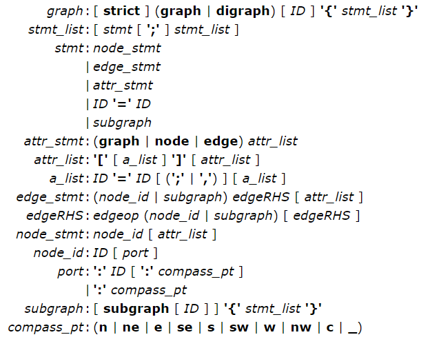

# Graphviz 介绍

## 在 Windows 下安装

1.  下载

	下载地址：http://www.graphviz.org/Download_windows.php
	
1.  安装

	如果下载的是 msi 版本，直接安装即可。如果下载的是 zip 版本，将其解压缩到本地机器上。

1.  配置环境变量

	将安装目录下的 bin 目录添加到 Path 环境变量中。
	
1.  验证

	打开 windows 命令行，输入 `dot -version`，检查是否显示 graphviz 的版本信息。
	
## 快速入门

打开 gvedit.exe，可以在其中编写脚本语言，然后保存为 `gv` 格式的文件。

## Dot 语言

以下是定义 DOT 语言的抽象语法。terminals  以粗体文字显示，nonterminals 显示为斜体。字面字符（literal characters）以单引号提供。括号“(”和“)” 表示分组。方括号“[”和“]”包含了可选的项。竖线“|”分隔可替换的项。



关键字 **node**，*edge*，**graph**，**digraph**，**subgraph** 和 **strict** 都是不区分大小写的。 还要注意，允许的 compass point 值不是关键字，所以这些字符串可以在其他地方用作普通标识符，相反，解析器实际上可以接受任何的标识符。

ID 可以是以下项之一：

*   任何字母字符串（[a-zA-Z\200-\377]），下划线（'_'）或数字（[0-9]），不能以数字开头;

*   数字 [-]?(.[0-9]+ | [0-9]+(.[0-9]*)? )

*   任何双引号字符串（"..."），可能包含转义引号('")1;

*   一个 HTML 字符串（<...>）。

一个 ID 只是一个字符串; 缺少前两种形式的引用字符只是为了简单起见。 abc_2 和 “abc_2” 之间，或 2.34 和 “2.34” 之间都没有语义上的差别。 显然，要使用一个关键字作为一个 ID，必须引用它才行。 请注意，在 HTML 字符串中，尖括号必须以匹配的成对形式出现，并且允许换行符和其他格式化空格字符。

此外，内容必须是合法的 XML，为了将这些字符嵌入到属性值或原始文本中，可能需要 对 "，＆，< 和 > 转换为特殊的 XML 转义序列。作为 ID，HTML 字符串可以 是任何合法的 XML 字符串，但如果用作标签属性，则会被特别解释，并且必须遵循 [HTML-like labbels](http://www.graphviz.org/content/shapes.html#html)的语法。

引用的字符串和 HTML 字符串都将作为一个单元进行扫描，因此任何嵌入的注释都将被视为字符串的一部分。

边缘是 - 在有向图和 - 在无向图中。

在有向图中使用 -> 作为边（*edgeop*），在无向图中使用 -- 作为边（*edgeop*）。

## 示例

无向图：

```
graph example1 {
	Server1 -- Server2
	Server2 -- Server3
	Server3 -- Server1
}
```

有向图：

```
digraph example3 {
Server1 -> Server2
Server2 -> Server3
Server3 -> Server1

Server1 [shape=box, label="Server1\nWeb Server", fillcolor="#ABACBA", style=filled]
Server2 [shape=triangle, label="Server2\nApp Server", fillcolor="#DDBCBC", style=filled]
Server3 [shape=circle, label="Server3\nDatabase Server", fillcolor="#FFAA22",style=filled]
}
```

你可以轻松控制图中每个节点的形状、颜色和标签。具体方法是列出每个节点的名称，然后将选项放在名称后面的括号中。例如，代码行 `Server1[shape=box,label="Server1\nWebServer",fillcolor="#ABACBA",style=filled]` 定义了 Server1 节点应该是一个长方形，有一个 Server1\nWeb Server 标签（\n 表示一个新行），颜色设为十六进制 (hex) 颜色 #ABACBA，而且该颜色应该填充了节点。

**二叉树**

```
digraph g {
    node [shape = record,height=.1];
    node0[label = "<f0> |<f1> G|<f2> "];
    node1[label = "<f0> |<f1> E|<f2> "];
    node2[label = "<f0> |<f1> B|<f2> "];
    node3[label = "<f0> |<f1> F|<f2> "];
    node4[label = "<f0> |<f1> R|<f2> "];
    node5[label = "<f0> |<f1> H|<f2> "];
    node6[label = "<f0> |<f1> Y|<f2> "];
    node7[label = "<f0> |<f1> A|<f2> "];
    node8[label = "<f0> |<f1> C|<f2> "];
    "node0":f2 -> "node4":f1;
    "node0":f0 -> "node1":f1;
    "node1":f0 -> "node2":f1;
    "node1":f2 -> "node3":f1;
    "node2":f2 -> "node8":f1;
    "node2":f0 -> "node7":f1;
    "node4":f2 -> "node6":f1;
    "node4":f0 -> "node5":f1;
}
```