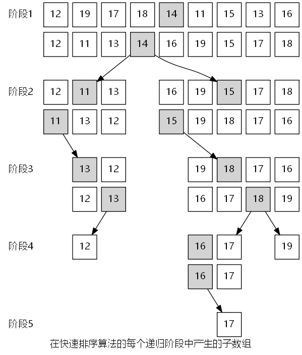

# Graphviz 示例（算法）

## 排序

### 快速排序

[源代码](samples/sort/subarray-states-of-each-stage-during-the-division-of-the-process.txt)

[源代码](samples/sort/subarray-generated-in-quick-sorting.txt)

### 合并排序

[源代码](samples/sort/subarray-generated-in-merge-sorting.txt)

[源代码](samples/sort/merge-the-subarray-in-merge-sorting.txt)
