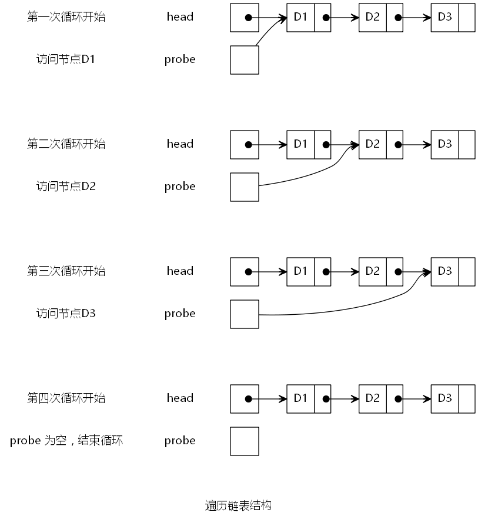
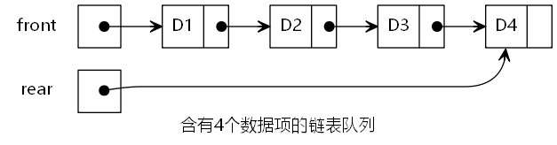

# Graphviz 示例（数据结构）

## 数组

### 数组的结构

[源代码](samples/array/array-structure.txt)

### 地址连续的内存块

[源代码](samples/array/contiguous-address-in-memory.txt)

### 使用二分查找法在数组中查找特定的项

[源代码](samples/array/binary-search-in-array.txt)

## 链表

### 链表的数组表示

[源代码](samples/linked-list/representation-of-linked-list-with-array.txt)

### 链表的基本操作

#### 遍历链表结构

[源代码](samples/linked-list/traverse-of-linked-list.txt)

#### 在链表的首端插入数据项

[源代码](samples/linked-list/insert-at-the-head-of-linked-list-1.txt)

[源代码](samples/linked-list/insert-at-the-head-of-linked-list-2.txt)

#### 在链表的尾端插入数据项

[源代码](samples/linked-list/insert-at-the-end-of-linked-list.txt)

#### 在链表的两项之间插入一个数据项

[源代码](samples/linked-list/insert-between-two-items-of-linked-list.txt)

#### 在链表的两项之间移除一项

[源代码](samples/linked-list/remove-between-two-items-of-linked-list.txt)

### 循环链表

#### 带有虚头节点的空循环链表

[源代码](samples/linked-list/empty-circular-linked-list-with-dummy-head.txt)

#### 插入第一个节点后的循环链表

[源代码](samples/linked-list/circular-linked-list-after-inserting-first-node.txt)

## 双向链表

#### 在双向链表的尾端插入一项

[源代码](samples/linked-list/insert-at-the-end-of-double-linked-list.txt)

## 堆栈

### 含有4个数据项的栈的数组表示

[源代码](samples/stack/representation-of-stack-with-array.txt)

### 向链式栈中增加一个数据项

[源代码](samples/stack/push-of-stack.txt)

### 从链式栈中弹出一个数据项

[源代码](samples/stack/pop-of-stack.txt)

## 队列

### 含有4个数据项的链表队列

[源代码](samples/queue/queue-with-linked-list.txt)

### 向链表队列中添加一个数据项

[源代码](samples/queue/enqueue-of-queue.txt)

### 具有4个优先级的链式优先队列

[源代码](samples/queue/priority-queue-with-linked-list.txt)

## 散列

### 带有5个桶的散列表

[源代码](samples/hash-table/hash-table-sample.txt)

## 树

### 树及其属性

[源代码](samples/tree/tree-and-its-property.txt)

### 二叉树的不同类型

[源代码](samples/tree/diff-types-of-binary-tree.txt)

### 普通树及其链表表示

[源代码](samples/tree/tree-and-its-representation-of-linked-list.txt)

### 二叉树及其链表表示

[源代码](samples/tree/binary-tree-and-its-representation-of-linked-list.txt)

### 用二叉树表示普通树

[源代码](samples/tree/tree-and-its-representation-of-binary-tree.txt)

### 完全二叉树及其数组表示

[源代码](samples/tree/binary-tree-and-its-representation-of-array.txt)

### 二叉搜索树

下图显示了一棵典型的数组的二叉查找调用树。访问过的用于比较的数据项用阴影部分表示。

[源代码](samples/tree/binary-search-call-tree-of-array.txt)

现在将二叉搜索树中的阴影部分数据项移至一个更加清楚的二叉树结构，如下图所示。该树是一个二叉搜索树，其每个节点都大于或等于其左子节点，且小于或等于其右子节点。

[源代码](samples/tree/binary-search-tree.txt)

如同对有序数组进行二分查找一样，二叉搜索树的查找也可能会在每次比较后减少一半的查找空间。这里“可能”是因为查找效率在一定程度上取决于树的形状。例如，下面的三种二叉搜索树含有相同的数据项，但是查找的效率却是逐次降低的。注意，数据以排序的方式构建的树并不是最佳的搜索树。

[源代码](samples/tree/binary-search-tree-with-same-data.txt)

### 一些表达式树

[源代码](samples/tree/some-exp-trees.txt)
