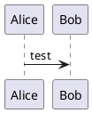
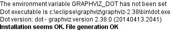
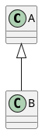

# 安装和运行

## 下载

下载地址：http://plantuml.com/download

## 安装

通常下载的是 PlantUML compiled Jar，那么直接将保存在于本地硬盘上即可。

## 关于 Graphviz

除了时序图（sequence diagrams）和活动图（activity beta diagrams
）外的其他图表均依赖于 Graphviz，所以通常你还需要安装并配置好 Graphviz。

## 验证

首先测试时序图，然后再测试其他图表。

### 测试时序图

在命令行中执行下列命令，检查是否生成对应的图片。

```
java -jar plantuml.jar -verbose sequenceDiagram.txt
```

在 sequenceDiagram.txt 文件中，你可以编写一个很简单的测试：



### 测试其他图表

注意，你必须首先安装 Graphviz。

在命令行中运行下列命令，检查输出结果中是否提示已成功安装了 Graphviz。

```
java -jar plantuml.jar -testdot
```



在命令行中运行下列命令，检查是否生成对应的的类图。

```
java -jar plantuml.jar -verbose classDiagram.txt
```

classDiagram.txt 文件的内容很简单：

