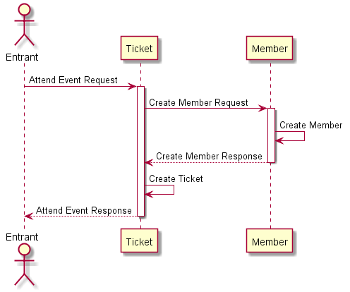
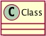
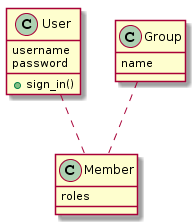
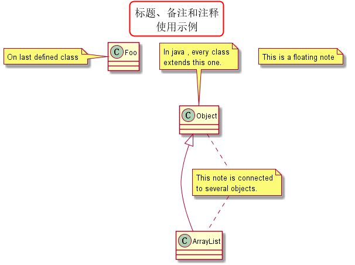

# PlantUML 速查表

## Diagram

### Behavior

### Structure

## UML

### Use Case

### Activity

### State

### 时序（Sequence）

关键字 | 用法 | 图片
------ | ---- | ----
`->` | | 
`<--` | | 
`->>` | | 
`<<--` | | 

```
@startuml

actor Entrant

Entrant -> Ticket : Attend Event Request

activate Ticket
Ticket -> Member : Create Member Request

activate Member
Member -> Member : Create Member
Ticket <-- Member : Create Member Response
deactivate Member

Ticket -> Ticket : Create Ticket
Entrant <-- Ticket : Attend Event Response
deactivate Ticket

@enduml
```



### 类（Class）

关键字 | 用法 | 图片
------ | ---- | ----
`class` | 类 | 
`+` | Public | 
`-` | Private | 
`#` | Protected | 
`~` | Package | 
<code><&#124;--</code> | 继承（extension） | 
<code><&#124;..</code> | 实现（implements） | 
`o--` | 聚合（aggregation）| 
`*--` | 组成（composition） | 

```
@startuml
class User {
  username
  password
  +sign_in()
}

class Group {
  name
}

class Member {
  roles
}

User .. Member
Group .. Member
@enduml
```



### Object

### Component

## 通用（Common）

###  标题（Title）、备注（Note）、注释（Comment）

关键字 | 用法
------- | -----
`title` | 设置一个标题。<br/>在标题描述中使用 `\n` 表示换行。<br/>可以使用一些 skinparam 设置来指定标题的边框。
`title`、`end title` | 定义多行标题。<br/>你可以在标题中使用 creole 格式。
`note top`、`note top of` | 添加一个位于上边的备注。
`note bottom`、`note bottom of` | 添加一个位于下边的备注。
`note left`、`note left of`| 添加一个位于左边的备注。
`note right`、`note right of` | 添加一个位于右边的备注。
`note` | 添加一个备注（不指定位置）。
`'` | 所有以单引号 `'` 开头的行都是注释行。
`/'`、`'/` | 多行注释以 `/'` 开头，以 `'/` 结尾。

```
@startuml
' 可以使用一些 skinparam 设置来指定标题的边框。
skinparam titleBorderRoundCorner 15
skinparam titleBorderThickness 2
skinparam titleBorderColor red

' 设置一个标题。
title 标题、备注和注释\n使用示例

Object <|--- ArrayList
note top of Object : In java , every class\nextends this one.

/'
	单独用 note 关键字定义一个备注，
	然后可以使用 .. 符号可以作出一条连接它与其它对象的虚线。
'/
note "This is a floating note" as N1
note "This note is connected\nto several objects." as N2
Object .. N2
N2 .. ArrayList

class Foo
note left: On last defined class
@enduml
```


### Element

### Package

### Arrow

## Salt

### Basic widgets

### Tree widgets

## Tips

### Example

#### Component

#### Sequence
