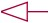

# PlantUML Quick lookup table

## Diagram

### Behavior

### Structure

## UML

### Use Case

### Activity

### State

### Timing（Sequence）

KeyWord | Usage | Image
------ | ---- | ----
`->` | | 
`<--` | | 
`->>` | | 
`<<--` | | 

```
@startuml

actor Entrant

Entrant -> Ticket : Attend Event Request

activate Ticket
Ticket -> Member : Create Member Request

activate Member
Member -> Member : Create Member
Ticket <-- Member : Create Member Response
deactivate Member

Ticket -> Ticket : Create Ticket
Entrant <-- Ticket : Attend Event Response
deactivate Ticket

@enduml
```


### class

Keyword | Usage | Pictures
------ | ---- | ----
`class` | class | 
`+` | Public | 
`-` | Private | 
`#` | Protected | 
`~` | Package | 
<code><&#124;--</code> | extension | 
<code><&#124;..</code> | implements | 
`o--` | aggregation| 
`*--` | composition | 

```
@startuml
class User {
  username
  password
  +sign_in()
}

class Group {
  name
}

class Member {
  roles
}

User .. Member
Group .. Member
@enduml
```


### Object

### Component

## Common

###  Title、Note、Comment
Keyword | usage
------- | -----
`title` | Set a title. Use `\n` to indicate a line break in the title description. You can use some skinparam settings to specify the border of the title.
`title`, `end title` | Define multiple line headings. You can use the creole format in the title.
`note top`, `note top of` | Add a comment above.
`note bottom`, `note bottom of` | Add a comment below.
`note left`, `note left of`| Add a comment on the left.
`note right`, `note right of` | Add a comment on the right.
`note` | Add a note (do not specify a location).
`'` | All lines beginning with single quotes `'` are comment lines.
`/'`,`'/` | Multi-line comments begin with `/'` and end with `'/`.

```
@startuml
' You can use some skinparam settings to specify the border of the title.
skinparam titleBorderRoundCorner 15
skinparam titleBorderThickness 2
skinparam titleBorderColor red

' Set a title.
Title title, notes, and comments\nexamples

Object <|--- ArrayList
note top of Object : In java , every class\nextends this one.

/'
	Define a note with the note keyword alone.
You can then use the .. symbol to make a dashed line connecting it to other objects.
'/
note "This is a floating note" as N1
note "This note is connected\nto several objects." as N2
Object .. N2
N2 .. ArrayList

class Foo
note left: On last defined class
@enduml
```


### Element

### Package

### Arrow

## Salt

### Basic widgets

### Tree widgets

## Tips

### Example

#### Component

#### Sequence
