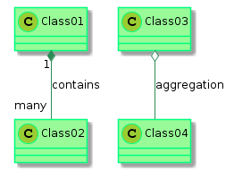

# skinparam 命令

PlantUML 默认使用特定颜色和形状的图标来表示不同的可访问性。可以使用 `skinparam` 命令停用该特性。

```
skinparam classAttributeIconSize 0
```

可以使用 `skinparam` 命令来使用 Graphviz 的属性。

```
skinparam nodesep 100
```

可以使用 `skinparam` 命令来更改绘图的颜色和字体。

```
@startuml
skinparam class {
BackgroundColor PaleGreen
ArrowColor SeaGreen
BorderColor SpringGreen
}
skinparam stereotypeCBackgroundColor YellowGreen
Class01 "1" *-- "many" Class02 : contains
Class03 o-- Class04 : aggregation
@enduml
```

